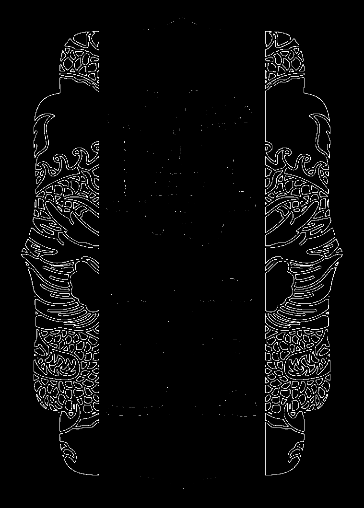
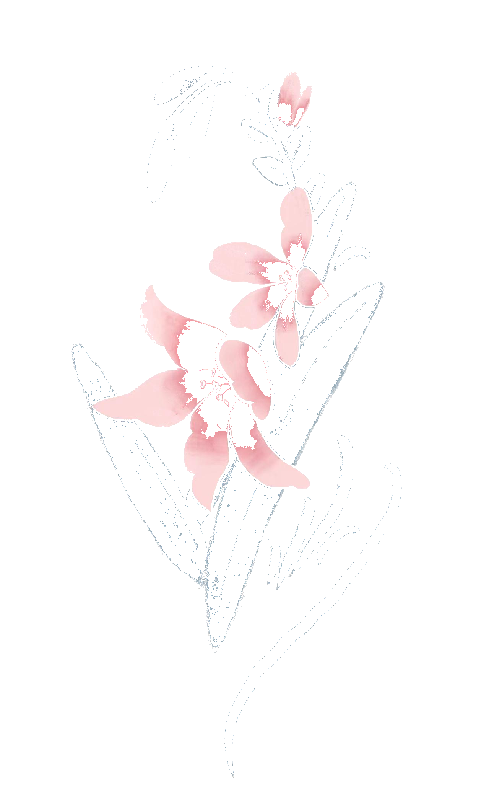
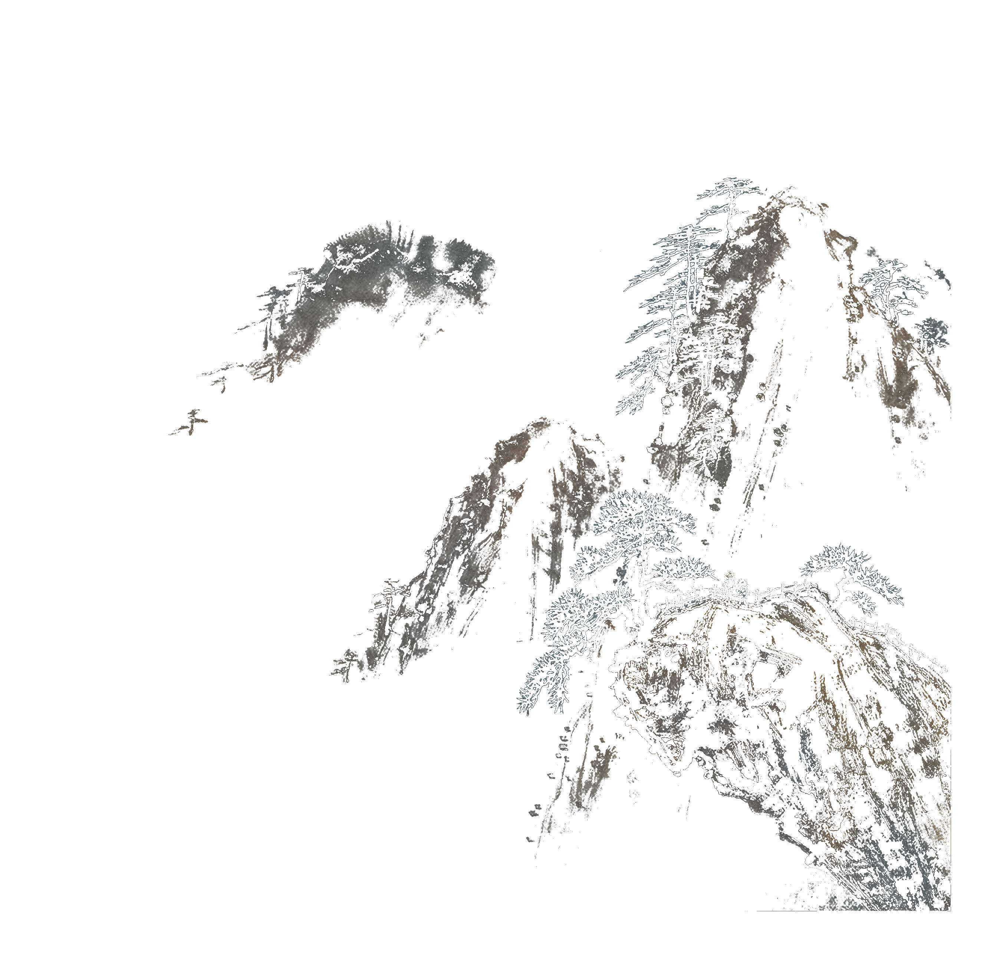

# 基于聚类的颜色分类

## 功能
### 1. 拥有可交互的界面，可以基于图片的颜色数量自由选择

### 2. 可以为图片创建蒙版
蒙版可以在生成的文件夹中看到

<div style="display: flex; justify-content: space-between;">
    
    
</div>
<div style="display: flex; justify-content: space-between;">
    
    
</div>

### 3. 颜色平滑


# 效果
## 1. 颜色分层

<div style="display: flex; justify-content: space-between;">
    
    
    
</div>
<div style="display: flex; justify-content: space-between;">
    
    
</div>

<div style="display: flex; justify-content: space-between;">
    
</div>
<div>
    
    
<div>

<div style="display: flex; justify-content: space-between;">
    
    
</div>
<div>
    
    
<div>


## 2. 颜色平滑
<div style="display: flex; justify-content: space-between;">
    
    
</div>
<div style="display: flex; justify-content: space-between;">
    
    
</div>

# 使用教程
## python3.10
## 第一步创建虚拟环境并安装相应的库
```
python -m venv venv
# windows
.\venv\Scripts\activate

# linux
source venv/bin/activate

pip install -r requirements.txt
```

## 执行程序
```
python color_seg.py
```

# 注意事项
1. 默认精度是0.001
2. 默认单轮最大迭代次数是20次
3. 界面交互可以调节的迭代次数外循环（即每一次迭代次数都会执行单轮最大迭代次数是20次）